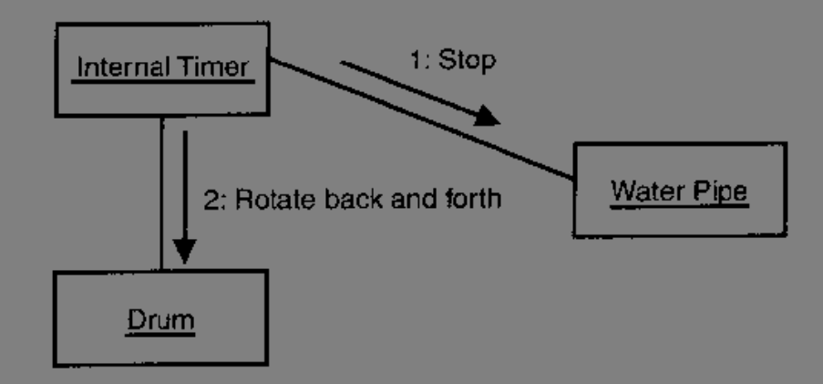
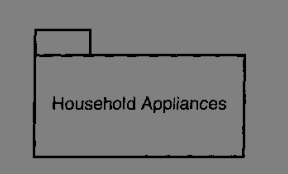
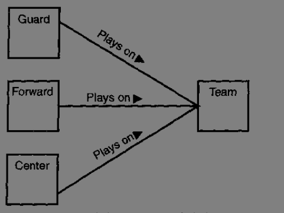
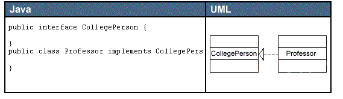

# 软件建模

有人觉得，软件其实就是机器代码或可执行代码，这确实没错

这些所谓的机器代码和可执行代码，实际上，就是一种描述，一种可以被计算机“理解”的描述的二进制代码

当然可能还有人觉得，软件是用高级程序设计语言书写的源程序代码，这也没错。

那么，什么是广义上的“软件”呢

事实上，只要用某种方式将它们描述出来，那么所得到的结果就都是“软件”

因此，软件的开发过程归根到底是描述的过程，而程序，只是高级程序语言对要解决的问题的一种描述。

这种描述，实质上是对系统实现的描述，也可以将程序代码说成是用编程语言描述的有关系统实现的模型

我们都知道，对于面向对象的分析与设计方法中最引人关注的软件制品就是模型（对象）。为系统选择和建立模型是当今软件开发中所要做的最重要的工作之一。

在开发的过程中，每一个工作人员都需要有一个独特的系统视角。构造软件的过程就是一个构造模型的过程，即采用不同的模型来描述系统所有不同视角的过程。这个过程也称为建模。，描述模型的工具，也称为建模语言。

而UML（Unified Modeling Language，统一建模语言）就是一种标准的**软件建模语言**。

# UML

## 1、什么是UML

UML（Unified Modeling Language，统一建模语言）是一种可视化的建模语言，它能让系统构造者用标准的，易于理解的方法建立起能够表达出他们想象力的系统蓝图，并且提供了便于不同人之间有效地共享和交流设计结果的机制。

说白了，它定义了一种人人都能理解和接受的规则，这个规则用于表达系统的设计。

## 2、为什么需要UML

术语：

- 系统：软硬件的结合体，它能提供业务问题的解决方案，
- 系统开发：为客户建议一个系统的过程
- 客户：需要解决问题的人
- 系统分析员：将客户的问题编成文档，并转交给开发人员
- 开发人员：为了解决客户问题而构造软件并在计算机硬件上实施该软件的程序员

> 痛处

在没有UML之前，系统开发往往是无计划的议题。

系统分析员尽力去获取客户的需求，用某种他自己能理解（可能客户不一定能理解）的表示法来产生需求分析文档，然后由程序员实现

但是，这个过程中，往往潜伏着各种问题

- 系统分析员没有正确理解客户的需求
- 编制的文档客户不能理解
- 系统分析的结果对程序员不明确

这也是一些旧系统既笨重，麻烦，而却难以使用的原因

> 问题

在早期，程序员在编程的时候，很少对手头的问题进行详细的分析，又由于是自底向上编程程序，随着时间的进展代码不断扩充，导致的后果显而易见。。。

如今，一个经过深思熟虑的计划至关重要。客户必须理解开发组在做什么，如果开发组没有充分理解客户需求的话，客户必须能够指出需求所发生的变化。

但是如今的系统越来越复杂，通常包括了多个软件单元（微服务） ，远程请求（第三方），还要连接到信息量堆积如山的数据库上。

这时候，最关键的一点，就是要用一种系统分析员，程序员，客户和其他系统开发所涉及到的人员之间能够理解和达成一致的方法来组织系统的设计过程。

UML就提供了这种组织方式

## 3、UML的组成

UML包括了一些可以相互组合图表的图形元素

由于UML是一种语言，所以UML具有组合这些元素的法规（语法），我们先简单的了解一下UML最常见的图和他们所表达的概念，然后再学习复杂的规则。

UML提供这些图的目的是用多个视图来展示一个系统，这组视图被称为一个模型（model）。

模型这个概念不是固定的，在不同的领域中有着不同的理解，他可能是一组数学方程式，可能是一个伪代码等等，当你建立一个模型后，你其实就是在运用你已经了解的很多知识来帮助你理解暂时还不知道的很多东西。

> 类图

一个类是一类或者一组具有类似属性和共同行为的事物。

比如例子，属于洗衣机( washing machine )类的事物都具有诸如品牌(brand name)、型号( model name)、序列号(serial number)和容量(capacity)等属性。这类事物的行为包括加衣物( add clothes)、加洗涤剂(add detergent)、 开机(turn on)和取出衣物(remove clothes )

矩形方框代表类的图表，他被分成3个区域，最上面的区域是类名，中间区域是类的属性，最下面区域里列的是类的操作。

> 对象图

对象是一个类的实例，是具有具体属性值和行为的一个具体事物。

例如你的洗衣机品牌可能是“美的”的，型号为“XXXX”，序列号为“GL2257”，一次最多能洗10斤的衣服

> 用例图

用例是从用户的观点对系统行为的一种描述。

对于系统开发人员来说，用例是一个有价值的工具：它是用来从用户的角度收集系统需求的一项技术

比如你使用一台洗衣机，显然是为了洗衣服。

代表洗衣机用户的直立小人被称为参与者，椭圆形代表用例。

参与者可以是一个人也可以是另一个系统。

> 状态图

在任一给定的时刻，一个对象总是处于某一特定的状态。

比如一个人可以使新生儿，婴儿，儿童，少年

一台洗衣机可以处于浸泡（Soak），漂洗（Rinse），脱水（Spin）或者关机（OFF）

最顶端的符号代表起始状态，而最底端的符号表示终止状态

> 顺序图

类图和对象图表达的是系统的静态结构。

在一个运行的系统中，对象之间要发生交互，并且这些交互要经历一定的时间，UML顺序图所表达的正是这种基于时间的动态交互。

比如微信的支付业务，你在官网上就可以看到这样一张顺序图

这是客户端之间的交互，当然也可以是对象之间发送信息，就拿我们的洗衣机来看

洗衣机的构件包括一个注水的进水管( Water Pipe)、一个用来装衣物的洗涤缸(Drum) 及一个排水管(Drain)。 当然，这些构件也是对象。

当“洗衣服”这个用例被执行时，将会依次发生什么事情呢?假设你已经完成了“加衣物”、“加洗涤剂”和“开机”操作，那么步骤应按照如下顺序进行:
1.通过进水管向洗涤缸中注水。
2.洗涤缸保持5分钟静止状态。
3.水注满，停止注水。
4.洗涤缸往返旋转15分钟。
5.通过排水管排掉洗涤后的脏水。
6.重新开始注水。
7.洗涤缸继续往返旋转洗涤。
8.停止向洗衣机中注水。
9.通过排水管排掉漂洗衣物的水。
10.洗涤缸加快速度单方向旋转5分钟。
11.洗涤缸停止旋转，洗衣过程结束。

图中，对象之间发送的消息有:注入新水(Send fresh water)、 保持静止(Remainstationary)、停止注水(Stop)、往返旋转( Rotate back and forth)、排掉洗涤后的脏水(Send soapywater)、排掉漂洗过的水( Send rinse water)等。

> 活动图

如上面所说，用例和对象的行为中的各个活动之间通常具有时间顺序

我们看看步骤4~6之间按顺序的UML活动图

> 协作图

系统的工作目标是由系统中各组成元素相互协作完成的，建模语言必须具备这种协作关系的表达方式，UML协作图就是为此目的设计的。

举个例子：如果这时候往洗衣机构件的类中添加一个内部计时器，在经过某一段时间后，定时器停止注水，然后启动洗涤缸往返旋转，几个部件完成这一个活动，那么这时候就可以用我们的协作图表示了

> 构件图

在构件图中，将系统中可重用的模块封装为具有可代替性的**物理单元**，称为构件。

他是在一个系统或子系统中的封装单位，提供一个或多个接口。

构件是系统中可替代的物理部分，是现实存在的。每个构件都必须提供特定的功能，在实现时必须遵从某种构建标准。

现代软件开发都是基于构件的，这种开发方式对于群组开发尤为重要

> 部署图

UML部署图显示了基于计算机系统的物理体系结构

它可以描述计算机和设备，展示它们之间，以及驻留在每台计算机中的软件

每台计算机用一个立方体来表示，立方体之间的连线表示这些计算机之间的通信关系

## 4、其他特征

接下来介绍一些用来组织和扩展模型图的特征

> 包

这里的包和Java的包的概念很相似，用于分组

> 注释

用于对某一部分给出明确的解释

> 构造型

构造型使你能够使用现有的UML元素来定制新的元素

有点像你从货架上买了一套衣服，然后再把这套衣服裁剪成你需要的样子，而不是重头开始织

构造型用两对括号括起来的一个名称来表示，这个括号叫做双尖括号

举个例子，接口这个概念是使用构造型的一个好例子。接口是一个没有属性而只有操作的类。它是可以在整个模型中反复使用的一组行为。

像这种，我们无需发明一个新的UML元素来表示接口，你可以在类图标中类名的上面加一个《Interface》构造型来表示接口

## 5、小结

系统开发是一项人力活动，如果没有易于理解表示法系统，开发过程就会冒很大的错误风险

UML就是一套表示法系统，它已经成为系统开发领域中的标准。

它由一组图组成，使得系统分析员可以利用这一标准来建立能够为客户，程序员以及任何参与开发过程的人员理解的多视图的系统蓝图。

因为不同风险的承当人通常会使用不同种图相互交流，因此UML包含所有这些种类的图是很有必要的。

#  结合面向对象使用

这里如果有同学对面向对象不是很了解的话，自行学习

## 1、类的可视化表示

在UML中，一个矩形表示一个类的图标。

按照UML的约定，类名的首字母大写，如果是由两个单词组成，那么将这两个单词合并，第二个单词首字母大写

另一个是包，它的名字对类名有影响。

包是UML组织图形元素的单位，用一个一边突起的的文件夹来表示，他的名字是一个文字串

如果WashingMachine（洗衣机）类是Househould Appliances（家用电器）包的一部分，那么这个类的名字为：Household Appliances::WashingMachine，包名在左，类名在右，中间用双冒号隔开。这种类型的类名叫：路径名

## 2、属性

属性是类的一个特性。它描述了类的对象（实例）所具有的一系列特性值。

按照UML的约定，单字属性名小写。如果属性名包含了多个字，这些字要合并，并且除了第一个字外其余字首字母要大写。

属性名列表放在类名之下，并且和类名之间用分隔线隔开

类的属性再该类的每个实例都有具体值，对象名首字母小写，后面跟一个冒号，冒号后面是该对象所属的类名，并且整个名字要带下划线

如果是匿名实例，可以直接写为WashingMachine

UML还允许指明属性的附加信息。在类的图标里，你可以指定每个属性值的类型。

要指明类型，则在属性值后面加上类型名，中间用冒号隔开，还可以为属性指定一个缺省值。

## 3、操作

操作是类能做的事情，也就是方法

按照UML的约定，单字属性名小写。如果属性名包含了多个字，这些字要合并，并且除了第一个字外其余字首字母要大写。

操作名列表放在属性名之下，两者之间用分隔线隔开

在操作右面的括号中可以说明操作所需要的参数和参数类型。

## 4、属性，操作和可视化把表达

在表示多个类的时候，通常没有必要总是显示这些类的所有属性和操作，可以只给出类名，而将属性或者操作区（或者两者全部）空着

如果想要只显示部分操作和属性，可以在列表后面加上3个小点“...”

如果属性或者操作列表太长，可以用构造型来组织属性或操作列表

对于属性列表来说，可以使用一个构造型作为部分属性的标题

## 5、职责和约束

在操作列表框下面的区域，你可以用来说明类的职责，职责描述了类做什么，也就是类的属性和操作能完成什么任务。

更形式化的方式是使用约束，它是用一个花括号括起来的自由格式的文本

括号中的文本指定了该类所要满足的一个或者多个规则。

例如：假设你想指定WashingMachine类的洗衣机容量只能是16，18或者20磅，你可以在WashingMachine类的图标旁边写一个约束“｛capacity = 16 or 18 or 20lb｝”

## 6、注释

除了上面介绍的之外，我们还可以通过对类附加注释给类添加更多的信息

通常我们都是对属性或者操作添加一个注释，比如我们注释说明serialNumber（序列号）属性引用了政府标准，根据这个注释就可以参考相关标准以查阅如何生成WashingMaching类对象的serialNumber值

## 7、如何识别他们

类代表的往往是领域知识中的词汇和术语。在建立类时，我们往往要注意需求（业务）中名词和动词，他们往往会作为该类的属性和方法

最后再结合一些常识，便可以为一个类建立比较全面的属性和操作，当然，这需要一定的经验。

# 关系

上一节我们讲的都是模型，这一节我们来看看怎么把这些模型串起来

主要有几种：

- 关联
- 多重性
- 限定关系
- 自身关联
- 继承和泛化
- 依赖

## 关联

当类之间在概念上有连接关系的时候，类之间的连接就叫做关联。

比如队员和球队之间的关联，队员为球队效力（play on）

关联的可视化表示方法是用一条线连接两个类，并把关联的名字（“play on”）放在这个连接线之上。

关联的方向用一个实心三角形箭头来指明

当一个类和另外一个类发生关联时，每个类通常在关联中都扮演着某种角色。

可以在图中靠近每个类的地方的关联线上标明每个类的角色

关联还可以从另一个方向发生：篮球队雇佣队员

可以把这两个方向上的关联表示在一个图中，用实心三角形箭头指明各自关联的方向

还能几个类连接同一个类

> 约束

关联上也可以添加约束，可以通过关联线附近加注一个约束来说明这个规则

比如一个Bank Teller（银行出纳员）为一个Customer（顾客）服务（Sewrvice），但是服务的顺序要按照顾客排队的次序进行。

另一种类型的约束是Or（或）关系，通过在两条关联线之间连一条虚线，虚线之上标注“｛or｝”来表示这种约束。

比如高中生（High school student）选（Choose）专业（Academic）课，或者选商务（Commercial）课时的模型

>关联类

和类一样，关联也可以有自己的属性和操作。这时候，这个关联可以称之为关联类

关联类实际上也是一种类，其可视化表示的方式和正常的类一样，但是要用一条虚线把关联类和对应的关联线连接起来

同时关联类也可以与其他的类进行关联

举个例子，Player类和Team类之间的Plays On关联对应的关联类：Contract（契约）关联类。它同时和GeneralManager（总经理）发生关联

> 链

正如对象是类的实例一样，关联也有自己的实例。

一个特定的队员效力一个特定的球队，那么两者之前的Plays On关系就叫做一个链（link），可以用两个对象之间的连线来表示他

和对象的名字要加下划线一样，链的名字也要加下划线

## 多重性

关联关系实际上有多重性，某个类有多少个对象可以和另一个类的单个对象关联。

表示多重性的方法是在参与关联的类附近的关联线上注明多重性的数值

比如：一个篮球队对应5名队员

这个例子所举的多重性并不是唯一可能的类型

两个类之间的关系可以一对一，一对多，一对一或多，一对零或一，一对有限间隔（5~10）。。。

UML使用星号（*）来代表许多和多个。在一种语句中，两点代表Or关系，例如“1 ·· *” 代表一个或者多个

在另一种语境中，Or关系用逗号来表示，例如 “5， 10” 代表5或者10

## 限定关联

当关联的多重性是一对多时，就产生了一个特殊的问题：查找问题。

当一个类的对象必须要选择规则中另一个的特点对象来满足关联中的角色时，第一个类必须要依赖一个具体的属性值来找到正确的对象。

这个属性值通常是一个标识符号，例如ID号。

在UML中，ID（identification）信息被称之为限定符。他的符号是一个和要执行查找的类连在一起的小矩形

## 自身关联

有时，一个类可能与它自己发生关联，这样的关联被称为自身关联，当一个类可以充当多种角色时，自身关联就发生了

比如一个车上的人，既可能是一个司机，又可能是一个乘客。

如果是一个司机，那么一个CarOccupant可以驾驶（Drives）零个到多个乘客（passenger）。

## 继承与泛化

继承，在UML中称之为泛化

在UML中，用父类到子类之间的连线来表示继承关系。

父类连线部分，指向父类的一端带有一个空心三角形箭头，这种连接类型的短语含义为is a kind of（属于。。。中的一种）

## 依赖

还有一种类间关系是一个类使用了另一个类。这种关系叫做依赖，依赖比关联的程度更浅

最通常的依赖关系是一个类操作的型构中用到了另一个类的定义。

在UML中，在有依赖关系的类间画一条带箭头的虚线来表示

# 聚集，组成，接口和实现

## 聚集

如果一个类是由几个部分组成的，这种特殊类型的关系被称为聚集（aggregation）

部分类和由它们组成的类之间是一种整体-部分关联。比如显示器是计算机的一部分

整体和部分之间用带空心菱形箭头的连线连接，箭头指向整体

注意：聚集是可以传递的

有时候，一个聚集体可能有多重部分体组成，这些部分体之间是“Or（或）”关系。

比如一顿饭包括汤（Soup）或者沙拉，主食（maincource）和甜点（Dessert）

## 组成

组成是强类型的聚集。聚集中的每个部分体只能属于一个整体。

例如咖啡桌（Coffee Table）是一个组成体，它的部分体是有桌面（TableTop）和桌腿（Leg）。

组成的表示法和聚集的表示方法类似，除此之外菱形箭头是实心

聚合和组合的区别在于：

- 聚合关系是“has-a”关系，组合关系是“contains-a”关系；
- 聚合关系表示整体与部分的关系比较弱，而组合比较强；
- 聚合关系中代表部分事物的对象与代表聚合事物的对象的生存期无关，一旦删除了聚合对象不一定就删除了代表部分事物的对象。组合中一旦删除了组合对象，同时也就删除了代表部分事物的对象。 

## 语境

在对系统建立模型时，类通常以类簇的形式出现，这些类簇中的类之间常常有聚集或组成关系

UML提供了集中考察其中的某个类簇的方式，也就是语境图

语境图有点像一幅大图中某个局部的子图，以获取详细信息

举个例子，假设你要建立一个衬衫的类模型，并说明衬衫的尺寸和组成

一个类型的语境图将衬衫类画成一个大矩形框，里面嵌套了该衬衫的各个组成部分的类图

组成语境图重点关注衬衫和衬衫的内部构成

如果要展示衬衫加上衣挂，挂载衣架上，放在衣柜中的情景，那么必须要扩大建模范围

## 接口和实现

前面我们提到了继承的可视化方式，接下面我们看看类和接口之间的关系

类和接口之间的关系称之为实现，用一个带空心三角形箭头来表示，箭头方向指向接口

另一种表示法（省略表示法）是将接口表示成一个小圆圈，并和实现它的类用一条线连起来

## 可见性

可见性应用于属性或操作，他说明在给定的属性和操作（或者接口的操作）的情况下，其他类可以访问到的属性和操作的范围。

可见性有三种层次（级别）：

- 公有：其他类可以直接访问这个层次中的属性和操作；在UML中，在属性或操作名前面带个“+”
- 受保护：只有继承了这些属性和操作的子类可以访问最初的属性和操作；在UML中，在属性或操作名前面带个“#”
- 私有：只有最初的类才能访问这些属性和操作；在UML中，在属性或操作名前面带个“-”

